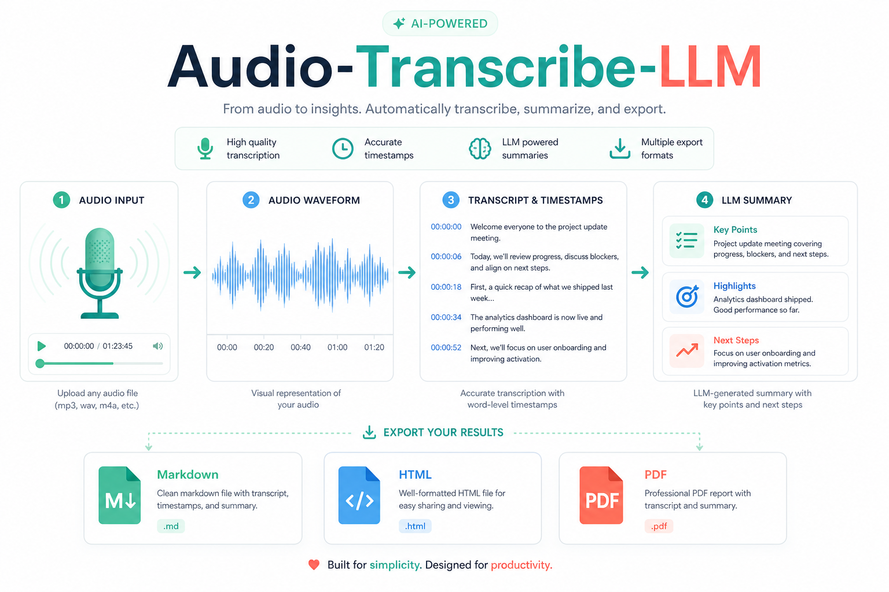
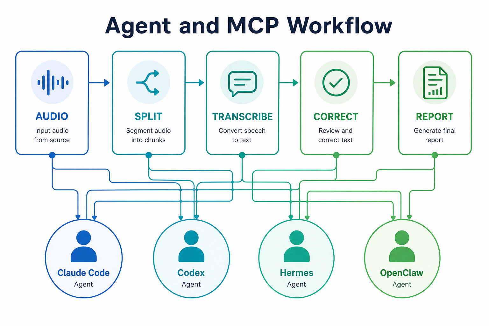

# Audio-Transcribe-LLM

[简体中文](./README.md) | **English**



A long-audio transcription tool built for Agents: Doubao Seed 2.0 Lite/Mini for audio understanding, DeepSeek V4 Pro or any OpenAI-compatible text model for correction, summarization, and report formatting.

> The project display name is **Audio-Transcribe-LLM**. To keep copy-paste commands working, the GitHub repo name, Python package name, and CLI command use the lowercase slug: `audio-transcribe-llm`.

This project started as Saltyu's personal Claude Code skill. The open-source version adds:

- No built-in API keys — everything is managed via `.env`.
- The scattered MCP servers are consolidated into a single `Audio-Transcribe-LLM` MCP server.
- Works with Claude Code, Codex, Hermes, OpenClaw, and any other MCP/Skill-capable Agent.
- Ships with one-click setup scripts, skill templates, command templates, tutorials, and competitor comparison notes.

## Who Is This For

- People who want to hand long audio — meetings, interviews, lectures, podcasts — to their local Agent.
- People who want to use cloud model quotas (e.g. Volcano Ark) at low cost.
- People who want to keep their own Agent workflow instead of uploading audio to a fixed meeting-notes SaaS.

## Competitors

- **iFlytek Tingjian / 听见** ([official site](https://www.iflyrec.com/)): a speech-to-text and meeting-notes SaaS from iFlytek. Supports app/web recording, imported audio/video transcription, speaker separation, translation, and cloud storage, plus paid human-precision transcription. Pricing: machine quick transcription at **RMB 0.33/min** (≈ RMB 19.8/hour); human precision transcription starts at **RMB 2.17/min** for Chinese. The old membership plan has been retired — current billing is pay-per-use plus prepaid packages (e.g. the Enjoy package with 6,000 transcription minutes per month, ≈ RMB 518/year in-app).
- **Feishu Minutes / 妙记** ([official site](https://www.feishu.cn/product/minutes)): an audio/video transcription and smart meeting-notes tool inside the Feishu (Lark) ecosystem. Supports meetings, recordings, and video-to-text, with speaker identification, AI summaries, to-do extraction, multilingual translation, and mind maps. Pricing: the free plan includes **300 minutes** of transcription per month; **AI Membership at RMB 69/month** includes 3,000 minutes/month; **AI Membership Plus at RMB 138/month** includes 6,000 minutes/month; the Business Standard plan (from RMB 50/user/month) offers unlimited Minutes transcription.

**This project**: on top of competitive transcription quality, it additionally offers—

| Capability | iFlytek Tingjian | Feishu Minutes | This Project |
| --- | :---: | :---: | :---: |
| Long-audio transcription + speaker separation | ✅ | ✅ | ✅ |
| Ambient-sound analysis | ❌ | ❌ | ✅ |
| Speaker emotion analysis | ❌ | ❌ | ✅ |
| Plug into your own workflow | ❌ | Feishu ecosystem only | ✅ any MCP/Skill Agent, one-click |

### Cost of Use

With seed2.0lite, **30 minutes of audio costs roughly: input ≤20k tokens, output ≤100k tokens, ≈ RMB 0.3**; switching to seed2.0mini brings it down to ≈ **RMB 0.15** — i.e. RMB 0.3–0.6 per hour, far below per-minute commercial transcription services.

Combined with the [Volcano Ark Collaboration Reward Program](https://www.volcengine.com/docs/82379/1391869) and its daily free tokens, **the transcription side can cost nothing**.

> Update (2026-09-04): ByteDance has removed seed 2.0 lite / 2.0 mini models from that program, so the free route above is temporarily unavailable. Watch the official page for changes.

## Quick Start

### Option A: Let your Agent set everything up

Copy this prompt to your Agent tool, e.g. Codex, Claude Code, Hermes, OpenClaw:

```text
Please install and configure Audio-Transcribe-LLM for me.

Project URL:
git clone https://github.com/saltyuuuuu/audio-transcribe-llm.git

Security note: never paste API keys into an Agent, chat window, Issue, or repo.
Copy `.env.example` to `.env` and fill in API keys only in a local terminal.

My Volcano Ark API key is already configured in the local `.env`.
My DeepSeek / other text-model API key is already configured in the local `.env`.

Text model config:
TEXT_BASE_URL=https://api.deepseek.com
TEXT_MODEL_ID=deepseek-v4-pro

Please do the following:
1. Clone the project and enter its directory.
2. Run the built-in one-click setup script.
3. Write my API keys into the local .env — never into README, code, or Git.
4. Generate and wire up MCP config for the current Agent.
5. Run a basic sanity check and tell me how to try it out.
```

After installation, send this to your Agent for a test drive. The repo ships with one Chinese and one English sample audio, so you don't need to find files yourself:

```text
Enter the Audio-Transcribe-LLM project directory and run a transcription + summary
using the built-in Chinese sample audio:
"examples/audio/sample_zh_mandarin_cc0.ogg"

Requirements:
1. Generate Markdown, HTML, and PDF reports.
2. If PDF fails, keep Markdown/HTML and explain why.
3. If any segment failed, keep the failure marker — never invent content.
4. Tell me the paths of the generated files.
```

To test English audio, swap in:

```text
"examples/audio/sample_en_librivox_pd.mp3"
```

The built-in samples are only for post-install smoke testing, not for accuracy claims. Sources and licenses: [examples/audio/README.md](examples/audio/README.md).

### Option B: Run the commands yourself

Windows PowerShell:

```powershell
git clone https://github.com/saltyuuuuu/audio-transcribe-llm.git
cd audio-transcribe-llm
powershell -ExecutionPolicy Bypass -File .\scripts\setup.ps1
```

macOS/Linux:

```bash
git clone https://github.com/saltyuuuuu/audio-transcribe-llm.git
cd audio-transcribe-llm
bash scripts/setup.sh
```

The script will prompt you for:

- `ARK_API_KEY`: Volcano Ark API key, used by Doubao Seed 2.0 Lite/Mini for audio reading.
- `TEXT_API_KEY`: DeepSeek or other OpenAI-compatible text-model API key.
- `TEXT_MODEL_ID`: defaults to `deepseek-v4-pro`. If your DeepSeek endpoint doesn't support this name, change it to any model returned by `/models`.

Generate a report:

```bash
audio-transcribe-llm --env .env report "D:/audio/meeting.mp3"
```

Raw transcription only:

```bash
audio-transcribe-llm --env .env transcribe "D:/audio/meeting.mp3"
```

The repo includes two ready-to-use, openly licensed audio files:

| File                                        | Language |  Length | Purpose                          |
| ------------------------------------------- | -------- | ------: | -------------------------------- |
| `examples/audio/sample_zh_mandarin_cc0.ogg` | Chinese  | ~30 sec | Test Chinese transcription       |
| `examples/audio/sample_en_librivox_pd.mp3`  | English  | ~52 sec | Test English transcription       |

```bash
audio-transcribe-llm --env .env report "examples/audio/sample_zh_mandarin_cc0.ogg" --no-pdf
audio-transcribe-llm --env .env report "examples/audio/sample_en_librivox_pd.mp3" --no-pdf
```

## Output

One task generates by default:

```text
转写结果_meeting/
├── 转写结果_meeting.md
├── 转写结果_meeting.html
└── 转写结果_meeting.pdf
```

The report includes:

- Raw transcription: preserves the model's original output and per-segment failure markers.
- Corrected version: fixes homophones, terminology, slips of the tongue, and obvious ASR errors.
- Segmented summary: topics, participants, time ranges, and analysis.
- PDF/HTML: easy to share, archive, and print.

## Agent Integration

The pipeline is "audio input → Doubao audio understanding (transcription / ambient sound / emotion) → text-model correction and summary → structured report", all invocable by an Agent through the MCP server:



The setup script generates:

```text
generated-configs/
├── claude-mcp.json
├── codex-config-snippet.toml
└── hermes-openclaw-mcp.json
```

`generated-configs/` contains your private local API keys and is ignored by `.gitignore`. Never commit this directory to GitHub.

After configuration, a user's machine typically ends up with:

- 1 MCP server: `Audio-Transcribe-LLM`
- 3 MCP tools: `transcribe_long_audio`, `generate_audio_report`, `analyze_media`
- 1 optional Skill: `audio-transcribe-llm`, so Claude Code or Codex recognizes tasks like "transcribe this audio / write meeting minutes"
- 1 optional Claude command: `/audio-transcribe-llm`
- 1 local `.env`: stores `ARK_API_KEY`, `TEXT_API_KEY`, model names, and runtime parameters

You can also use the repo templates directly:

- Claude Code Skill: `skills/claude/audio-transcribe-llm/SKILL.md`
- Codex Skill: `skills/codex/audio-transcribe-llm/SKILL.md`
- Claude command: `commands/audio-transcribe-llm.md`

See [docs/AGENT_INTEGRATION.md](docs/AGENT_INTEGRATION.md) for details.

## Model Strategy

Default priority:

1. `doubao-seed-2-0-lite-260428`
2. `doubao-seed-2-0-mini-260428`
3. Text correction/summary: `deepseek-v4-pro` or any user-configured text model

We recommend keeping Doubao Seed 2.0 Lite/Mini for audio (multimodal audio models are usually pricier), while the text model can freely switch to DeepSeek Flash, Kimi, GLM, Mimo, or any OpenAI-compatible endpoint.

## Documentation

- [Zero-to-hero tutorial: Volcano Ark + DeepSeek (Chinese)](docs/GETTING_STARTED.md)
- [Agent integration guide (Chinese)](docs/AGENT_INTEGRATION.md)
- [Model switching cheat sheet (Chinese)](docs/MODEL_SWITCHING.md)
- [Benchmark & competitor comparison (Chinese)](docs/BENCHMARK_AND_COMPETITORS.md)
- [Image prompt notes (Chinese)](docs/IMAGE_PROMPTS.md)
- [GitHub publishing checklist (Chinese)](docs/PUBLISHING.md)
- [Sources (Chinese)](docs/SOURCES.md)

## Security Notes

Never commit `.env`, API keys, private audio files, or private transcription results to this repo; the two openly licensed samples in `examples/audio/` are the only exceptions. Before publishing, run:

```bash
python scripts/check_secrets.py
```

## References

- Volcano Ark Collaboration Reward Program: https://www.volcengine.com/docs/82379/1391869
- Volcano Ark model list: https://www.volcengine.com/docs/82379/1330310
- DeepSeek API docs: https://api-docs.deepseek.com/
- DeepSeek models & pricing: https://api-docs.deepseek.com/quick_start/pricing
- Tongyi Tingwu: https://tingwu.aliyun.com/
- iFlytek Tingjian: https://www.iflyrec.com/
- Feishu Minutes: https://www.feishu.cn/product/minutes
- OpenAI Whisper: https://github.com/openai/whisper
- FunASR: https://github.com/modelscope/FunASR

## License

MIT
